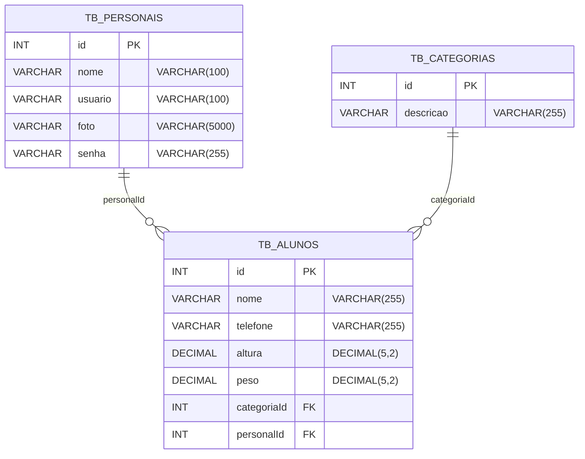

# Move+ 🏋️‍♀️📈 — Sistema de Gestão de Academia

O **Move+** é um sistema desenvolvido para auxiliar academias no **controle e organização de dados** de **colaboradores (personais)**, **alunos** e **categorias de treino**, permitindo **cadastrar, consultar, atualizar e excluir** informações de forma prática, segura e centralizada.

Projeto Integrador — **Generation Brasil (Turma JavaScript 12)** — **Grupo 04**  
Integrantes: Alberto Duran · André César · Bruna Melo · Giovanna Roberta · Jacqueline Cardeal · Renato Sales

---

## 📌 Sumário

1. [Visão Geral do Projeto](#-visão-geral-do-projeto)
2. [Modelo de Negócio](#-modelo-de-negócio)
3. [Público-alvo e Casos de Uso](#-público-alvo-e-casos-de-uso)
4. [Principais Funcionalidades](#-principais-funcionalidades)
5. [Arquitetura e Banco de Dados](#-arquitetura-e-banco-de-dados)
6. [Tecnologias Utilizadas](#-tecnologias-utilizadas)
7. [Requisitos do Sistema](#-requisitos-do-sistema)
8. [Instalação](#-instalação)
9. [Configuração Inicial](#-configuração-inicial)
10. [Guia Rápido de Uso (Rotas)](#-guia-rápido-de-uso-rotas)
11. [Testes (Insomnia)](#-testes-insomnia)
12. [Estrutura do Projeto](#-estrutura-do-projeto)
13. [Implementações Futuras](#-implementações-futuras)
14. [Como Contribuir](#-como-contribuir)
15. [Licença](#-licença)

---

## 🔎 Visão Geral do Projeto

O **Move+** foi criado para facilitar a gestão de colaboradores e alunos de uma academia.  
Por meio dele, é possível manter os treinos sempre atualizados, consultar informações rapidamente e organizar o cadastro de personais e alunos de acordo com suas categorias de treino.

O sistema foi desenvolvido para ser **simples de usar**, **confiável** e **preparado para crescer** conforme a necessidade do negócio.

---

## 💼 Modelo de Negócio

Sistema desenvolvido para auxiliar academias no **controle e organização** dos dados de seus colaboradores e alunos, permitindo **cadastrar, consultar, atualizar e excluir** informações de forma prática, segura e centralizada.

---

## 👥 Público-alvo e Casos de Uso

### Quem pode usar?
- **Profissionais (personais)**: suporte ao controle de alunos e categorias.

### Exemplos de cenários de uso
- Cadastrar novos alunos e vinculá-los a um personal.
- Organizar alunos por **categoria de treino**.
- Consultar personais por **nome**.
- Calcular o **IMC** de um aluno rapidamente (método especial).

---

## ✅ Principais Funcionalidades

### Cadastro
- Cadastrar novos **personais**, **alunos** e **categorias** no sistema.

### Consulta
- Buscar todos os **personais**, **alunos** ou **categorias** cadastradas.
- Buscar **personal**, **aluno** ou **categoria** por **ID**.
- Buscar **personais por nome**.
- Buscar **categorias por descrição**.
- **Calcular IMC dos alunos (Método Especial)**.

### Atualização
- Atualizar dados de **personal**, **aluno** ou **categoria** já cadastrados.

### Exclusão
- Excluir **personais**, **alunos** ou **categorias** quando necessário.

---

## 🧱 Arquitetura e Banco de Dados

O sistema utiliza **banco de dados relacional** para garantir integridade e organização das informações.

### DER (Diagrama Entidade–Relacionamento)

- Um **personal** pode ter vários **alunos**.
- Uma **categoria** pode ter vários **alunos**.
- Cada **aluno** pertence a **uma categoria** e pode estar vinculado a **um personal**.


### Cadastro de Colaboradores (Personais) — Dados armazenados
ID: identificador único
Nome: nome completo
Usuário: e-mail para login
Senha: senha para login
Foto: imagem para identificação

## 🚀 Tecnologias Utilizadas
Segundo o escopo, o sistema foi desenvolvido:

Em ambiente web
Com estrutura organizada e segura
Com banco de dados relacional para garantir integridade das informações
Observação: se o seu repositório tiver a stack exata (ex.: Node/Nest, Java/Spring etc.), você pode detalhar aqui com nomes/versões.

## 🖥️ Requisitos do Sistema
Ambiente para rodar a aplicação (ex.: Node.js, Java, etc. — conforme seu projeto)
Banco de dados relacional (ex.: MySQL, PostgreSQL etc.)
Ferramenta de teste de API (recomendado): Insomnia ou Postman
### 🛠️ Instalação
1. Clone o repositório:
```bash
git clone https://github.com/SEU-USUARIO/SEU-REPOSITORIO.git
```
2. Entre na pasta do projeto:
```bash
cd SEU-REPOSITORIO
```
3. Instale as dependências (caso seja Node.js):
```bash
npm install
```
4. Inicie o projeto (ajuste o comando conforme o seu package.json):
```bash
npm run start
```
### ⚙️ Configuração Inicial
1. Crie um arquivo .env na raiz do projeto (ajuste os nomes conforme sua aplicação):

```env
# Servidor
PORT=4000

# Banco de dados (exemplo)
DB_HOST=localhost
DB_PORT=3306
DB_USER=seu_usuario
DB_PASS=sua_senha
DB_NAME=move_mais
```

## 🚀 Guia Rápido de Uso (Rotas)
Abaixo está um guia baseado nas funcionalidades descritas e nos testes do Insomnia.

### Alunos
 - POST /alunos — Cadastrar aluno
 - GET /alunos — Consultar todos os alunos
 - GET /alunos/:id — Consultar aluno por ID
 - PUT /alunos/:id — Atualizar aluno
 - DELETE /alunos/:id — Deletar aluno
- GET /alunos/:id/imc — Consultar IMC do aluno (método especial)
### Personais
 - POST /personais — Cadastrar personal
 - GET /personais — Consultar todos os personais
 - GET /personais/:id — Consultar personal por ID
 - GET /personais/nome/:nome — Consultar personal por nome
 - PUT /personais/:id — Atualizar personal
 - DELETE /personais/:id — Deletar personal
### Categorias
 - POST /categorias — Cadastrar categoria
 - GET /categorias — Consultar categorias
 - GET /categorias/:id — Consultar categoria por ID
 - GET /categorias/descricao/:descricao — Consultar categoria por descrição
 - PUT /categorias/:id — Atualizar categoria
 - DELETE /categorias/:id — Excluir categoria

## 📂 Estrutura do Projeto
```bash
├── node_modules
├── src
│   ├── aluno
│   │   ├── controllers
│   │   │   └── aluno.controller.ts      
│   │   ├── entities
│   │   │   └── aluno.entity.ts          
│   │   ├── services
│   │   │   └── aluno.service.ts         
│   │   └── aluno.module.ts              
│   ├── categoria
│   │   ├── controllers
│   │   │   └── categoria.controller.ts  
│   │   ├── entities
│   │   │   └── categoria.entity.ts      
│   │   ├── services
│   │   │   └── categoria.service.ts     
│   │   └── categoria.module.ts          
│   ├── personal
│   │   ├── controllers
│   │   │   └── personal.controller.ts   
│   │   ├── entities
│   │   │   └── personal.entity.ts       
│   │   ├── services
│   │   │   └── personal.service.ts      
│   │   └── personal.module.ts           
│   ├── app.controller.spec.ts
│   ├── app.controller.ts
│   ├── app.module.ts                    
│   ├── app.service.ts
│   └── main.ts                          
├── test
├── .gitignore
├── .prettierrc
├── eslint.config.mjs
├── nest-cli.json
├── package-lock.json
├── package.json
├── README.md
├── tsconfig.build.json
└── tsconfig.json
```
## 🔮 Implementações Futuras
1. Filtro de personais por categoria:
 - Permitir que o aluno selecione uma categoria (ex.: musculação, funcional, cárdio) e visualize automaticamente os personais aptos àquela especialidade.

2. Adicionar métodos de pagamento:
 - Permitir que o aluno realize pagamentos dentro da plataforma.

3. Evolução e histórico do aluno
 - Registro de progresso, metas e acompanhamento ao longo do tempo.

 ***

<table>
  <tr>
    <td align="center"><a href="https://www.linkedin.com/in/alberto-janeiro"><br /><sub><b>Alberto Durán</b></sub></a><br />❤️</td>
    <td align="center"><a href="https://www.linkedin.com/in/andrecesar-dev/"><br /><sub><b>André Cesar </b></sub></a><br />❤️</td>
    <td align="center"><a href="https://www.linkedin.com/in/brunamelodev/"><br /><sub><b>Bruna Melo</b></sub></a><br />❤️</td>
    <td align="center"><a href="https://www.linkedin.com/in/giovannaroberta/"><br /><sub><b>Giovanna Roberta</b></sub></a><br />❤️</td>
    <td align="center"><a href="https://www.linkedin.com/in/jacqueline-cardeal/"><br /><sub><b>Jacqueline Cardeal</b></sub></a><br />❤️</td>
    <td align="center"><a href="https://www.linkedin.com/in/renato-sales-desenvolvedor/"><br /><sub><b>Renato Sales</b></sub></a><br />❤️</td>
  </tr>
</table>

